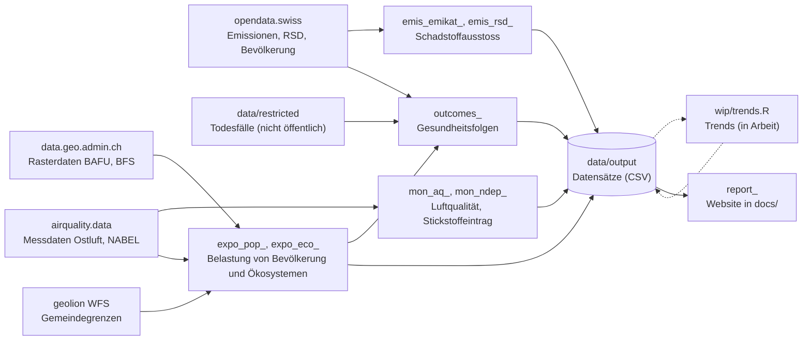

# Luftqualität im Kanton Zürich

## Auswertungen

Dieses Repository enthält systematische Auswertungen zu Luftschadstoffen im Kanton Zürich durch das kantonale [Amt für Abfall, Wasser, Energie und Luft](https://www.zh.ch/de/baudirektion/amt-fuer-abfall-wasser-energie-luft.html). Diese stellen eine Grundlage zur Beurteilung der [Luftqualität im Kanton Zürich](https://www.zh.ch/de/umwelt-tiere/luft-strahlung/luftqualitaet-auswirkungen.html) dar sowie für entsprechende Darstellungen auf dem [Internetauftritt des Kantons Zürch](https://www.zh.ch/de/umwelt-tiere/luft-strahlung/luftqualitaet-auswirkungen.html). Die Auswertungen behandeln die Langzeitbelastung durch Luftschadstoffe, in der Regel Jahreswerte. Sie ergänzen die Veröffentlichung [offener Behördendaten](https://www.zh.ch/de/politik-staat/opendata.html), indem die entsprechenden Grundlagendaten skriptbasiert verarbeitet werden. Somit wird die fundierte Auswertung zur Luftqualität im Kanton Zürich für Fachpersonen und die interessierte Öffentlichkeit transparent sowie reproduzierbar dokumentiert und zur Verfügung gestellt.


Es werden öffentlich verfügbare Grundlagendaten aus Messungen, Erhebungen und Berechnungen verwendet. Die Quellen dafür sind der [Kanton Zürich](https://www.zh.ch/de.html), [Ostluft - die Luftqualitätsüberwachung der Ostschweizer Kantone und des Fürstentums Liechtenstein](https://www.ostluft.ch/), das [nationale Beobachtungsnetz für Luftfremdstoffe NABEL](https://www.bafu.admin.ch/bafu/de/home/themen/luft/zustand/daten/nationales-beobachtungsnetz-fuer-luftfremdstoffe--nabel-.html), das [Bundesamt für Umwelt BAFU](https://www.bafu.admin.ch/bafu/de/home.html) und das [Bundesamt für Statistik BFS](https://www.bfs.admin.ch/bfs/de/home.html). Räumlicher Bezugsrahmen ist das Gebiet des Kantons Zürich. Die im Repository abgelegte Datei ["ressources.csv"](https://github.com/awelZH/airquality/blob/main/data/meta/ressources.csv) enthält Verweise zu allen verwendeten Grundlagendaten und ihren Quellen.


Ergebnis der entsprechenden [R-Auswertung](https://github.com/awelZH/airquality/tree/main/pipelines) ist ein Portfolio an [Datensätzen](https://github.com/awelZH/airquality/tree/main/data/output) und [Darstellungen](https://awelzh.github.io/airquality/) zum Schadstoffausstoss ("Emissionen") ausgewählter Luftschadstoffe, Luftqualitätsmesswerten ("Immissionen"), der Belastungsverteilung ("Exposition") der Wohnbevölkerung durch Luftschadstoffe sowie von empfindlichen Ökosystemen durch atmosphärische Einträge von reaktiven Stickstoffverbindungen. Zudem werden die statistisch abgeleiteten Gesundheitsfolgen der Bevölkerung durch Luftbelastung im Kanton Zürich am Beispiel vorzeitiger Todesfälle aufgezeigt.


Auf vertiefende fachliche Erläuterungen der Ergebnisse wird an dieser Stelle verzichtet.


## Grenz- und Richtwertvergleiche

Teilweise wird die Luftqualität mit den [Immissionsgrenzwerten der Luftreinhalteverordnung](https://www.fedlex.admin.ch/eli/cc/1986/208_208_208/de) oder [gleichwertigen Referenzwerten](https://www.bafu.admin.ch/bafu/de/home/themen/luft/publikationen-studien/publikationen/uebermaessigkeit-von-stickstoff-eintraegen-und-ammoniak-immissionen.html) verglichen. Zusätzlich wird die Luftqualität auch mit den [Richtwerten der Weltgesundheitsorganisation WHO](https://www.who.int/publications/i/item/9789240034228) verglichen. Die WHO-Richtwerte wurden im Jahr 2021 aufdatiert und drücken den gegenwärtigen Stand des Wissens zu gesundheitsschädlichen Auswirkungen durch Luftschadstoffe aus. Gemäss [Umweltschutzgesetzt](https://www.fedlex.admin.ch/eli/cc/1984/1122_1122_1122/de) sollten die Immissionsgrenzwerte vor jeglichen schädlichen Auswirkungen schützen, weshalb die [Eidgenössische Kommission für Lufthygiene EKL](https://www.ekl.admin.ch/de/eidgenoessische-kommission-fuer-lufthygiene-ekl) in einem [Bericht im Jahr 2023](https://www.ekl.admin.ch/inhalte/dateien/pdf/EKL-231120_de_orig.pdf) dem Bundesrat eine entsprechende Anpassung der Immissionsgrenzwerte empfohlen hat. Solange es massgebliche Unterschiede zwischen Richt- und Grenzwerten gibt, werden sich die rechtliche Beurteilung der "Übermässigkeit der Immissionen" gemäss Luftreinhalteverordnung von der wissenschaftlichen Beurteilung zur Gesundheitsschädlichkeit der Immissionen voneineander unterscheiden.


## Prozess

Dieses Auswerteprojekt enthält Funktionen und Skripte in der Programmiersprache [R](https://cran.r-project.org/). Wann immer möglich, werden offene, maschinenlesbare Schnittstellen benutzt, um die aktuellsten Daten ohne eine redundante Datenablage zu verwenden. Die  Messdaten der Luftqualitätsmessnetze sind öffentlich frei verfügbar, liegen jedoch noch ohne maschinenlesbare Schnittstelle vor. Daher müssen die entsprechenden Datensätze noch im Rahmen dieser Auswertungen lokal abgelegt werden. Die Quellen der Daten werden immer angegeben. Die Auswertungen werden jährlich durch das [Amt für Abfall, Wasser, Energie und Luft des Kantons Zürich](https://www.zh.ch/de/baudirektion/amt-fuer-abfall-wasser-energie-luft.html) nachgeführt sobald alle benötigten Grundlagendaten veröffentlicht sind (in der Regel per Ende des Folgejahrs).


## Ablauf der Auswertung

Die Auswertung ist eine [targets](https://docs.ropensci.org/targets/)-Pipeline mit einer Zielliste pro Teilauswertung (Ordner `pipelines/`, Namen der Ziele mit dem Präfix der Teilauswertung). Die Funktionen dazu liegen in `R/`, allgemeine Bausteine im R-Paket [airquality.methods](https://github.com/awelZH/airquality.methods), alle Einstellungen in `settings.R`. Die Versionen der R-Pakete sind mit [renv](https://rstudio.github.io/renv/) in `renv.lock` festgehalten.



Ausführen in R, im Projektordner:

```r
renv::restore()  # R-Pakete in den Versionen von renv.lock
source("run.R")  # Datensätze in data/output/, optional die Trends, dann die Website in docs/
```

Bei jedem Lauf wird zuerst nur abgefragt, ob sich die Grundlagendaten geändert haben: bei den Tabellen von opendata.swiss das Änderungsdatum und die Grösse jeder Datei, bei den Rasterdaten von data.geo.admin.ch das Änderungsdatum und die Prüfsumme. Geladen werden die Daten nur, wenn eine Datei neu ist oder sich geändert hat; die Tabellen von opendata.swiss sind zusammen über 1 GB gross. Die Gemeindegrenzen (geolion WFS, rund 5 MB) werden bei jedem Lauf neu geladen, die Messdaten stammen aus dem R-Paket airquality.data. Alle übrigen Schritte werden nur neu gerechnet, wenn sich ihre Eingaben, Funktionen oder Einstellungen geändert haben.

Eine Teilauswertung allein: `targets::tar_make(names = tidyselect::starts_with("emis_rsd_"))`. Überblick über alle Schritte: `targets::tar_visnetwork()` (interaktiv) oder `targets::tar_mermaid()`; ein Zwischenergebnis lesen: `targets::tar_read(<Ziel>)`; nach einem Fehler dessen Eingaben laden: `targets::tar_workspace(<Ziel>)`. Die Gesundheitsfolgen brauchen nicht öffentliche Daten zu den Todesfällen, siehe `data/restricted/README.md`.
